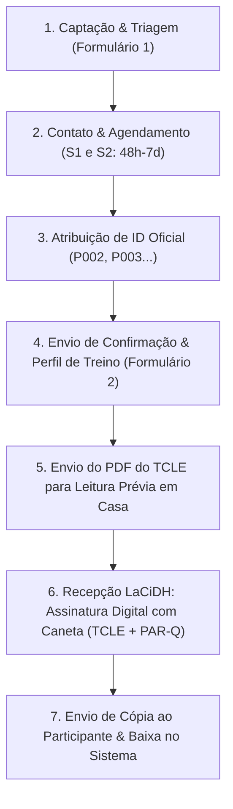

# PROCEDIMENTO OPERACIONAL PADRÃO (POP) – RECRUTAMENTO & CONSENTIMENTO
## RECRUTAMENTO, TRIAGEM, AGENDAMENTO, PERFIL MOTOR E CONSENTIMENTO (TCLE / PAR-Q)

**Laboratórios:** Laboratório de Cineantropometria e Desempenho Humano (LaCiDH) e Laboratório de Biomecânica e Controle Motor (LaBioCoM) – EEFERP-USP  
**Projeto de Mestrado:** Análise de Fatores Associados ao Desempenho no Handstand e Handstand Walk  
**Mestrando:** Guilherme de Paula Lemos | **Orientador:** Prof. Dr. Matheus Machado Gomes  

---

### 1. OBJETIVO GERAL DO POP
Padronizar detalhadamente todas as etapas de captação, triagem, agendamento, levantamento do perfil motor e consentimento ético dos voluntários do projeto de mestrado:
1. Captação e triagem preliminar de elegibilidade via formulário online (Formulário 1);
2. Agendamento logístico das sessões de teste com intervalo de 48 horas a 7 dias;
3. Atribuição automatizada do identificador oficial sequencial (P001, P002...);
4. Levantamento pré-teste de variáveis de treino, lateralidade e 1-RM Shoulder Press (Formulário 2);
5. Formalização ética e clínica do TCLE e PAR-Q (assinatura digital com caneta no celular ou impressa).

---

### 2. MOMENTO ZERO: ELEGIBILIDADE E CRITÉRIOS DE INCLUSÃO E EXCLUSÃO
* **2.1 Critérios de Inclusão:** Idade mínima de 18 anos (adultos de ambos os sexos); praticante regular há pelo menos 3 meses de modalidade com Handstand (CrossFit, Calistenia, Ginástica Artística, Circo, Yoga, Dança ou Handbalancing); sustentação estática livre sobre as mãos por no mínimo 3 segundos ou ao menos 3 passadas consecutivas no Handstand Walk.
* **2.2 Critérios de Exclusão:** Dor articular aguda, cirurgia musculoesquelética recente (< 12 meses) ou limitação funcional crônica em punhos, cotovelos, ombros ou coluna; resposta positiva impeditiva no PAR-Q.
* **2.3 Janela Temporal Inter-Sessões:** A Sessão 1 (LaCiDH) e a Sessão 2 (LaBioCoM) devem ocorrer obrigatoriamente com intervalo de 48 horas a 7 dias.
* **2.4 Sigilo e LGPD:** A Tabela Mestre de Identificação reside exclusivamente em 00_CADASTRO_TRIAGEM_E_TCLE. Todos os arquivos de dados brutos e datasets utilizam apenas o código desidentificado (P001, P002...).

---

### 3. FLUXOGRAMA DE ENTRADA

---

### 4. PROTOCOLO DETALHADO POR ETAPA

#### ETAPA 1: Captação e Triagem Preliminar (Formulário 1)
* **Objetivo:** Divulgação, captação de contatos, triagem preliminar de lesões e disponibilidade de horários.
* **Link de Envio aos Voluntários (Público):** https://docs.google.com/forms/d/1htV0NL9JDS0hB8gJnB7N0INYuv_Cs5-IH07DffEopY4/viewform
* **Link de Edição (Pesquisador):** https://docs.google.com/forms/d/1htV0NL9JDS0hB8gJnB7N0INYuv_Cs5-IH07DffEopY4/edit
* **Campos:** Nome completo, E-mail, WhatsApp, Contato de emergência, Nascimento/Idade, Sexo biológico, Histórico de dores ou limitações em punhos/ombros, Dias e Horários de preferência.

#### ETAPA 2: Contato e Agendamento Logístico
1. O pesquisador consulta os voluntários na aba 01_Banco_Interessados_Forms da Tabela Mestre;
2. Contato via WhatsApp para definição das datas da Sessão 1 (LaCiDH) e Sessão 2 (LaBioCoM), respeitando a janela de 48h a 7 dias;
3. Execução do agendamento (via chat ou script), que atribui o próximo ID oficial disponível (P002, P003...), atualiza a agenda visual e pré-carrega as planilhas de campo.

#### ETAPA 3: Perfil de Prática e Instruções Pré-Teste (Formulário 2)
* **Objetivo:** Coleta das variáveis independentes da pesquisa antes do encontro no laboratório.
* **Link de Envio ao Voluntário Agendado:** https://docs.google.com/forms/d/1suHdIVSFpFyUoRIarTKX9ttI6KG-XLqkwvcLD99DDQA/viewform
* **Link de Edição (Pesquisador):** https://docs.google.com/forms/d/1suHdIVSFpFyUoRIarTKX9ttI6KG-XLqkwvcLD99DDQA/edit
* **Variáveis:** Membro superior dominante (D/E), Meses de prática de Handstand, Horas semanais de treino, Frequência semanal, Modalidade principal e secundárias, Carga de 1-RM Shoulder Press (kg) e confirmação de prontidão articular ativa.
* **Orientações Pré-Teste (Sessão 1):** Jejum de 4 horas (bioimpedância); não consumir álcool ou cafeína nas 24h anteriores; não realizar treino vigoroso de membros superiores na véspera; trajes esportivos leves.

#### ETAPA 4: Consentimento Ético (TCLE) e Clínico (PAR-Q) Presencial
* **Assinatura Digital com Caneta no Celular (S-Pen / Stylus):**
  - O participante recebe previamente o PDF do TCLE via WhatsApp para leitura domiciliar tranquila;
  - No acolhimento da Sessão 1 (LaCiDH), o pesquisador abre o PDF oficial no Samsung Notes ou Adobe Acrobat;
  - O participante assina na tela do celular utilizando a caneta de precisão:
    1. Preenche Nome Completo e Documento (RG/CPF) na Folha 1;
    2. Rubrica o rodapé da Folha 1 no campo demarcado;
    3. Assina por extenso na Folha 2;
    4. Responde os 7 itens do PAR-Q e assina;
  - O pesquisador rubrica e assina nos campos correspondentes;
  - O documento é salvo como P00X_TCLE_assinado.pdf na pasta tcle_assinados/;
  - O pesquisador envia imediatamente uma cópia em PDF para o WhatsApp do participante;
  - O sistema registra a baixa automática na Tabela Mestre (status: TCLE Digital Validado).
* **Opção Impressa Alternativa:** Caso necessário, imprimir 2 vias do TCLE_Oficial_Imprimir.docx e 1 via do QUESTIONARIO_PAR_Q_PRONTIDAO.docx.

---

### 5. GUIA DE COMANDOS DO SISTEMA DE AUTOMAÇÃO

#### Opção A: Controle em Linguagem Natural no Chat (Antigravity)
* "Status do recrutamento" (Exibe resumo, total de candidatos e próximo ID oficial vago);
* "Sincronizar formulários" (Lê novas respostas dos Formulários 1 e 2 e atualiza a Tabela Mestre);
* "Quem tem disponibilidade na quinta-feira de manhã?" (Filtra voluntários no banco);
* "Agendar [Nome] para Sessão 1 dia DD/MM/AAAA às HH:MM e Sessão 2 dia DD/MM/AAAA às HH:MM";
* "Dar baixa no TCLE do P002".

#### Opção B: Linha de Comando no Terminal PowerShell
* **Ver Status Geral:**
  python "coleta\PILOTO OFICIAL\00_CADASTRO_TRIAGEM_E_TCLE\scripts\gerenciar_recrutamento_agendamento.py" --status
* **Listar Interessados no Banco:**
  python "coleta\PILOTO OFICIAL\00_CADASTRO_TRIAGEM_E_TCLE\scripts\gerenciar_recrutamento_agendamento.py" --listar
* **Filtrar por Dia da Semana e Turno:**
  python "coleta\PILOTO OFICIAL\00_CADASTRO_TRIAGEM_E_TCLE\scripts\gerenciar_recrutamento_agendamento.py" --dia "quinta" --turno "manhã"
* **Sincronizar Respostas dos Formulários:**
  python "coleta\PILOTO OFICIAL\00_CADASTRO_TRIAGEM_E_TCLE\scripts\gerenciar_recrutamento_agendamento.py" --sincronizar
* **Agendar Participante Oficial:**
  python "coleta\PILOTO OFICIAL\00_CADASTRO_TRIAGEM_E_TCLE\scripts\gerenciar_recrutamento_agendamento.py" --agendar "Nome" --data1 DD/MM/AAAA --hora1 08:00 --data2 DD/MM/AAAA --hora2 09:00
* **Verificar Baixas de TCLE Digital:**
  python "coleta\PILOTO OFICIAL\00_CADASTRO_TRIAGEM_E_TCLE\scripts\gerenciar_recrutamento_agendamento.py" --verificar-tcle

---

### 6. MAPEAMENTO DE DADOS E ARQUITETURA DE ARQUIVOS
| Variável | Origem | Destino Principal no Sistema |
| :--- | :--- | :--- |
| Nome, WhatsApp, E-mail | Formulário 1 | TABELA_MESTRE (01_Banco_Interessados_Forms) |
| Nascimento, Idade, Sexo | Formulário 1 | TABELA_MESTRE (02_Participantes_Oficiais) |
| Disponibilidade Dias/Horas | Formulário 1 | TABELA_MESTRE (03_Agenda_Setembro_2026) |
| Membro Dominante (D/E) | Formulário 2 | PLANILHA_CAMPO_LACIDH e LABIOCOM |
| Meses de Prática, Horas/sem | Formulário 2 | dataset_mestrado_completo_SPSS.csv |
| Modalidade Principal | Formulário 2 | TABELA_MESTRE e Dataset SPSS |
| PR 1-RM Shoulder Press (kg) | Formulário 2 | PLANILHA_CAMPO_LACIDH (aquecimento 1-RM) |
| TCLE / PAR-Q Assinados | Celular S-Pen | 00_CADASTRO_TRIAGEM_E_TCLE\tcle_assinados\ |
